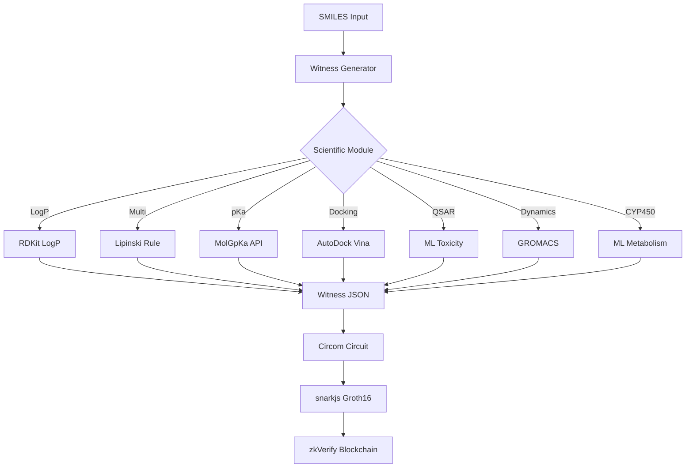

# 🧬 ZK_COMPLY v2.0 - Pharmaceutical ADMET Compliance with Zero-Knowledge Proofs
**STATUS: RELEASE v2.0 ✅ | 7 Scientific Modules ✅ | zkVerify Integrated 🚀**

[](LICENSE)
[](https://www.python.org/downloads/)
[](https://circom.io/)
[](https://github.com/iden3/snarkjs)
[](https://zkverify.io/)

> **v2.0 RELEASE:** Complete ADMET compliance system with 7 scientific modules  
> Zero-knowledge proofs for pharmaceutical validation using Circom/Groth16/zkVerify.

## 🎯 EXECUTIVE SUMMARY v2.0

**IMPLEMENTED SCIENTIFIC MODULES:**
- ✅ **LogP**: Partition coefficient (RDKit)
- ✅ **Multi**: Full Lipinski rule (RDKit)
- ✅ **pKa**: Acidity constant (MolGpKa API + fallback)
- ✅ **Docking**: Molecular affinity (AutoDock Vina + fallback)
- ✅ **QSAR**: Toxicity prediction (ML models + heuristics)
- ✅ **Dynamics**: Molecular simulation (GROMACS + fallback)
- ✅ **CYP450**: Enzymatic metabolism (ML + heuristics)

**FULL PIPELINE:**
- ✅ **Witness Generation**: 7 fully functional scientific modules
- ✅ **ZK Proofs**: Circom circuits + Groth16 via snarkjs
- ✅ **Verification**: Local and zkVerify fully integrated
- ✅ **REST API**: Endpoints for all modules
- ✅ **Robust Fallbacks**: Guaranteed operation without external dependencies

## 🏗️ ARCHITECTURE v2.0



### **Technology Stack v2.0:**
- **Backend**: Python 3.13 + FastAPI
- **Scientific Calculations**: RDKit, MolGpKa, AutoDock Vina, GROMACS
- **ZK Circuits**: Circom v2.2.2
- **Proof System**: snarkjs + Groth16
- **Blockchain**: zkVerify (Polkadot ecosystem)
- **API**: REST endpoints for all ADMET modules

## 🎯 Overview

ZK_COMPLY v2.0 is a complete **ADMET compliance system** (Absorption, Distribution, Metabolism, Excretion, Toxicity) that enables pharmaceutical companies to **prove regulatory compliance** without revealing:
- Proprietary molecular structures
- Specific test results
- Experimental methods used
- Sensitive intellectual property data

### 🧪 ADMET Scientific Modules

| Module | ADMET Area | Technology | Fallback | Status |
|--------|------------|------------|----------|--------|
| **LogP** | Absorption | RDKit | ✅ | ✅ |
| **Multi** | Absorption | RDKit (Lipinski) | ✅ | ✅ |
| **pKa** | Distribution | MolGpKa API | RDKit heuristics | ✅ |
| **Docking** | Distribution | AutoDock Vina | Molecular descriptors | ✅ |
| **CYP450** | Metabolism | ML models | Substructure analysis | ✅ |
| **Dynamics** | Excretion | GROMACS | Property estimation | ✅ |
| **QSAR** | Toxicity | ML models | Toxicophore analysis | ✅ |

### 🔒 Zero-Knowledge Features
- **Privacy**: SMILES and results are never revealed
- **Verifiability**: Mathematical proofs of compliance
- **Integrity**: Impossible to falsify results
- **Auditability**: Immutable trace on blockchain

## ✨ Features

### 🔬 **6 Scientific Analysis Modules**
- **LogP**: Partition coefficient (solubility)
- **pKa**: Acid dissociation constant
- **Docking**: Protein-drug molecular docking
- **QSAR**: Toxicity analysis via machine learning
- **Dynamics**: Molecular dynamics simulation
- **CYP450**: Hepatic enzymatic metabolism

### 🔒 **Zero-Knowledge Proofs**
- **Circom circuits** for each scientific module
- **Automatic witness generation**
- **snarkjs usage** for proving backends
- **Cryptographic verification** of compliance

### 🚀 **Complete REST API**
- **FastAPI** with endpoints for all modules
- **Batch processing** of molecules
- **Automatic documentation** (Swagger/OpenAPI)
- **Integrated end-to-end tests**

## 🏗️ Architecture

```
┌─────────────────┐    ┌─────────────────┐    ┌─────────────────┐
│   Computation   │    │   Zero-Knowledge │    │   Verification  │
│   Scientific    │ ── │    Circuits      │ ── │   Blockchain    │
└─────────────────┘    └─────────────────┘    └─────────────────┘
      RDKit               Circom Language        zkVerify Chain
   AutoDock Vina           snarkjs Compiler     Smart Contracts
    GROMACS ML              Groth16 Prover      Proof Registry
```

## 🚀 Quick Start v2.0

### Prerequisites
- Python 3.13+
- Node.js 18+ (for snarkjs and zkverifyjs)
- RDKit (pip install rdkit)

### Installation

```bash
# 1. Clone the repository
git clone https://github.com/your-user/ZK_COMPLY.git
cd ZK_COMPLY

# 2. Install Python dependencies
pip install -r requirements.txt

# 3. Install Node.js dependencies
npm install

# 4. Configure the environment
chmod +x setup.sh
./setup.sh

# 5. Run the API
python main.py
```

### Quick Usage

#### Individual Module Testing
```bash
# LogP (Absorption)
python src/witness_generator.py "CCO" logp

# Lipinski Rule (Absorption)
python src/witness_generator.py "CCO" multi

# pKa (Distribution)
python src/witness_generator.py "CCO" pka

# Docking (Distribution)
python src/witness_generator.py "CCO" docking

# Toxicity (Toxicity)
python src/witness_generator.py "CCO" qsar

# Molecular Dynamics (Excretion)
python src/witness_generator.py "CCO" dynamics

# CYP450 (Metabolism)
python src/witness_generator.py "CCO" cyp450
```

#### Full Pipeline with ZK Proof
```bash
# Generate ZK proof for LogP
python src/zk_pipeline.py --smiles "CCO" --module logp

# With submission to zkVerify
python src/zk_pipeline.py --smiles "CCO" --module logp --submit
```

#### REST API
```bash
# Start server
python main.py

# Test endpoint (new terminal)
curl -X POST "http://localhost:8000/compute/logp" \
     -H "Content-Type: application/json" \
     -d '{"smiles": "CCO"}'

# Full pipeline
curl -X POST "http://localhost:8000/pipeline" \
     -H "Content-Type: application/json" \
     -d '{"smiles": "CCO", "module": "logp"}'
```

### Basic Usage

```python
import requests

# Test a molecule (Aspirin)
response = requests.post("http://localhost:8000/test-all", 
    json={"smiles": "CC(=O)OC1=CC=CC=C1C(=O)O"})

print(response.json())
# {
#   "results": {
#     "logp": {"status": "success", "compliant": true},
#     "pka": {"status": "success", "compliant": true},
#     ...
#   },
#   "overall_compliance": true
# }
```

## 🚀 HOW TO USE (QUICK START)

### **1. Start Backend API**
```bash
cd /home/user/Documents/ZK_COMPLY
python -m uvicorn main:app --reload --host 0.0.0.0 --port 8000
```

### **2. Generate ZK Proof via API**
```bash
curl -X POST "http://localhost:8000/generate-zk-proof" \
     -H "Content-Type: application/json" \
     -d '{
       "smiles": "CCO",
       "circuit_type": "logp", 
       "submit_to_zkverify": false
     }'
```

### **3. Expected Result**
```json
{
  "pipeline_id": "pipeline_20250725_XXXXXX",
  "smiles": "CCO",
  "success": true,
  "compliance_result": true,
  "transaction_hash": null,
  "stages": {
    "witness_generation": {"success": true},
    "proof_generation": {"success": true}
  }
}
```

## 📁 PROJECT STRUCTURE

```
ZK_COMPLY/
├── main.py                    # Main FastAPI backend  
├── src/                       # Python services
│   ├── witness_generator.py   # Witness generation for Circom
│   ├── snarkjs_service.py     # snarkjs integration
│   ├── zkverify_service.py    # Submission to zkVerify
│   └── zk_pipeline.py         # Full pipeline
├── circuits/                  # Circom circuits
│   ├── simple_compliance.circom    # LogP compliance circuit
│   ├── compliance_circuit.circom   # Multi-criteria circuit
│   ├── circuit.zkey               # Proving key
│   └── verification_key.json      # Verification key
├── proofs/                    # Generated proofs and witnesses
├── scripts/                   # Auxiliary scripts
└── docs/                      # Technical documentation
```

## 🧪 TESTED EXAMPLES

### **Compliant Molecules:**
1. **Ethanol (CCO)**: LogP = -0.001 → ✅ Compliant
2. **Paracetamol derivative**: LogP = 3.224 → ✅ Compliant

### **Non-Compliant Molecules:**  
1. **C20 Chain**: LogP = 8.048 → ❌ Non-Compliant

### **Public Proof Outputs:**
- `["1", "hash"]` = Compliant + molecule hash
- `["0", "hash"]` = Non-Compliant + molecule hash

## 📊 Project Structure

```
zk-comply/
├── 📁 circuits/                 # Circom Circuits
│   ├── compliance_circuit.circom# Multi-criteria circuit
│   ├── simple_compliance.circom # LogP compliance circuit
│   ├── circuit.zkey             # Proving key
│   └── verification_key.json    # Verification key
├── 📁 src/                      # Python services
│   ├── witness_generator.py     # Witness generation for Circom
│   ├── snarkjs_service.py       # snarkjs integration
│   ├── zkverify_service.py      # Submission to zkVerify
│   └── zk_pipeline.py           # Full pipeline
├── 📄 main.py                   # Main FastAPI API
├── 📄 test_api.py               # API tests
├── 📄 requirements.txt          # Python dependencies
└── 📄 README.md                 # This file
```

## 🧪 Tests

```bash
# Test full API
python test_api.py

# Test specific module
python src/witness_generator.py "CCO" logp

# Test Circom circuit pipeline
python src/zk_pipeline.py --smiles "CCO" --module logp
```

## 🔧 Advanced Configuration

### Compliance Parameters

Each module allows configuring compliance thresholds:

```toml
# zk-comply-logp/Prover.toml
smiles_hash = "0x123..."
min_logp = -5000     # Minimum LogP (*1000)
max_logp = 5000      # Maximum LogP (*1000)
logp = 2300          # Current value (*1000)
```

### Blockchain Integration

For zkVerify integration:

```python
# Automatic proof submission
await zk_comply.submit_to_zkverify(
    smiles="CC(=O)OC1=CC=CC=C1C(=O)O",
    proofs=generated_proofs
)
```

## 🛣️ Roadmap

- [x] **Phase 1**: Scientific core + ZK circuits (✅ Complete)
- [x] **Phase 2**: Circom migration + zkVerify integration (✅ Complete)
- [ ] **Phase 3**: Web interface + industrial partnerships
- [ ] **Phase 4**: Multi-chain + advanced AI

## 🤝 Contribution

1. Fork the project
2. Create your feature branch (`git checkout -b feature/new-feature`)
3. Commit your changes (`git commit -am 'Add new feature'`)
4. Push to the branch (`git push origin feature/new-feature`)
5. Open a Pull Request

## 📄 License

This project is **private property** and is protected by a proprietary license.

**⚠️ IMPORTANT**: This software is provided for **viewing and educational purposes only**. Any commercial use, monetization, or redistribution is **strictly prohibited** without the owner's express authorization.

For commercial licensing inquiries, contact via GitHub Issues.

## 🤝 Contribution

Contributions are welcome via Pull Requests, but note that:
- By contributing, you agree that your contribution becomes part of the proprietary project
- The owner retains all rights over incorporated contributions
- Contributions do not grant commercial usage rights

## 🙏 Acknowledgments

- **Iden3** for snarkjs and Circom ecosystem
- **RDKit** for the computational chemistry library
- **ZK Community** for support and tools

## 📞 Contact

- **Issues**: [GitHub Issues](https://github.com/Marcos-sxt/zk-comply/issues)
- **Commercial Licensing**: Contact via marcossantos7955@gmail.com

---

**ZK_COMPLY - The future of pharmaceutical compliance is private, verifiable, and decentralized.** 🚀

**© 2025 Marcos Antonio Morais Braga - All rights reserved. Commercial use not authorized.**
